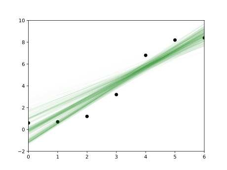
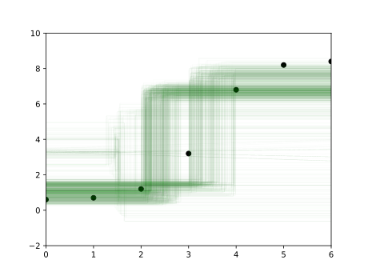
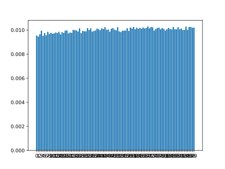

#  LazyPPL with MALA 

This is an implementation of [MALA](https://en.wikipedia.org/wiki/Metropolis-adjusted_Langevin_algorithm) for the [LazyPPL](https://lazyppl-team.github.io) non-parametric probabilistic programming library, starting from uniform distributions on the circle rather than the Lebesgue measure on the real line. So overall this is a high/infinite dimensional torus. 

Here are some examples, using the same source code as the original LazyPPL examples. 

## Linear regression 

500 samples with no burn-in:

MALA | Gaussian random walk | Original LazyPPL 
--- | --- | ---
 |  | 

## Piecewise linear regression 

2000 samples with no burn-in:

MALA | Gaussian random walk | Original LazyPPL 
--- | --- | ---
 |  | 
 
## Testing samples in one dimension

1 million samples:

Uniform | Standard Gaussian
--- | --- 
 | 
